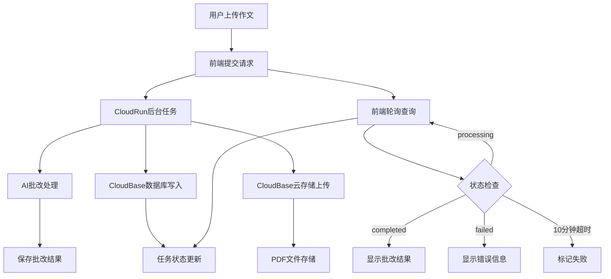

## 产品概述

修复AI作文批改系统的核心问题，确保系统稳定运行。当前系统已实现异步处理架构（CloudRun + 后台任务 + 前端轮询），主要Bug已修复，需完成部署和验证。

## 核心功能

- 数据库自动清理策略优化（1小时→24小时保留）
- 数据库写入错误处理机制完善
- 前端轮询超时时间延长（5分钟→10分钟）
- CloudBase SDK云存储上传功能验证
- 系统稳定性测试和文档更新

## 技术栈

- 后端: Node.js + Express.js + CloudBase SDK
- 前端: HTML + JavaScript
- 云服务: 腾讯云CloudBase（环境ID: cloud1-0gh78mpy39eccc0f, 区域: ap-shanghai）
- 部署平台: CloudRun

## 已修复的关键Bug

### 1. 数据库自动清理优化

- 问题: 1小时后自动删除记录导致正在处理的任务数据丢失
- 解决方案: 延长至24小时保留期
- 文件位置: server/index.js

### 2. 数据库写入错误处理

- 问题: 写入失败时未正确捕获和处理错误
- 解决方案: 添加完善的try-catch和错误日志
- 文件位置: server/index.js

### 3. 前端轮询超时时间

- 问题: 5分钟超时不足以完成AI批改
- 解决方案: 延长至10分钟（600秒）
- 文件位置: public/script.js

## 系统架构



## 数据流

```mermaid
flowchart LR
    User[用户上传] --> Frontend[前端]
    Frontend --> API[/api/upload]
    API --> Task[创建后台任务]
    Task --> DB[(数据库)]
    Task --> AI[AI批改]
    AI --> Storage[云存储]
    Storage --> DB
    Frontend --> Poll[轮询/api/status]
    Poll --> DB
    DB --> Result[返回结果]
```

## 关键技术细节

### 后台任务处理

- 使用CloudRun的runTask方法创建后台任务
- 任务ID存储在数据库中便于状态追踪
- 错误处理机制确保失败时更新数据库状态

### 前端轮询机制

- 每5秒查询一次任务状态
- 最长轮询时间10分钟（120次查询）
- 显示具体处理步骤（上传中、批改中、生成PDF中）

### CloudBase集成

- 数据库: 存储任务状态、批改结果
- 云存储: 保存生成的PDF报告
- 环境配置: cloud1-0gh78mpy39eccc0f (ap-shanghai)

## 集成服务

### tcb

- **用途**: 部署修复后的代码到CloudRun环境，验证数据库和云存储功能
- **预期结果**: 代码成功部署，系统稳定运行，所有修复的Bug得到验证