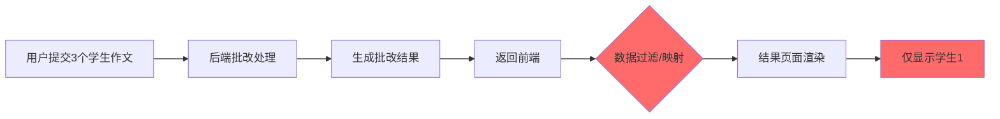

## 产品概述

定位并修复作文批改系统中学生2和学生3数据丢失的问题，确保结果页面能正常显示所有学生的批改结果并支持切换。

## 核心功能

- 追踪数据流转路径，找出学生2、学生3数据丢失的具体位置
- 修复数据过滤或丢失逻辑
- 验证修复后所有学生数据能正常显示和切换
- 部署修复后的版本

## 技术栈

- 前端：已有项目技术栈（待探索确认）
- 数据流：前端请求 → 后端处理 → 数据返回 → 前端渲染

## 技术架构

### 系统架构

复用现有项目架构，针对数据丢失问题进行定向修复。

### 数据流分析

### 问题定位方向

1. **后端响应检查**：确认后端是否返回了3个学生的完整数据
2. **前端数据处理**：检查前端接收数据后的过滤、映射或状态管理逻辑
3. **渲染逻辑**：检查页面渲染时是否存在条件判断导致部分数据被忽略
4. **状态管理**：检查是否存在状态更新不完整的问题

## 实现细节

### 核心排查路径

1. **网络请求层**：检查API响应数据完整性
2. **数据处理层**：检查数据解析、过滤、转换逻辑
3. **状态管理层**：检查状态更新和存储逻辑
4. **渲染层**：检查组件渲染条件和循环逻辑

### 关键代码结构

需要重点检查的代码模块：

- API请求处理函数
- 批改结果数据结构定义
- 结果页面组件渲染逻辑
- 学生切换功能实现

## Agent扩展

### SubAgent

- **code-explorer**
- 目的：全面探索项目代码，定位数据流转和渲染相关的所有关键文件
- 预期结果：找到批改结果处理、存储和渲染的完整代码路径，识别数据丢失的具体位置