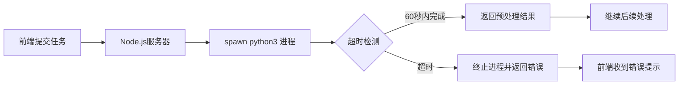

## 产品概述

修复AI作文批改系统中Python预处理脚本执行超时问题，确保图片预处理流程稳定运行。

## 核心功能

- 将server.js中的Python进程调用从`python`更改为`python3`，匹配Dockerfile中安装的Python版本
- 为processImageWithPython函数添加60秒超时保护机制
- 确保Python进程启动失败时能够被及时捕获和处理
- 防止前端因长时间等待而收到504超时错误

## 技术栈

- 后端框架: Node.js + Express.js
- Python版本: Python 3
- 进程管理: child_process.spawn
- 容器化: Docker

## 技术架构

### 系统架构

- 现有架构: Node.js服务器通过child_process调用Python脚本进行图片预处理
- 修复点: Python进程调用命令和超时控制机制

### 模块划分

- **进程调用模块**: server.js中的spawn调用逻辑
- **超时保护模块**: processImageWithPython函数的超时控制
- **错误处理模块**: Python进程失败的捕获和响应

### 数据流



## 实现细节

### 核心文件结构

```
project-root/
├── server.js           # 修改spawn调用和添加超时逻辑
└── preprocess.py       # Python预处理脚本(无需修改)
```

### 关键代码结构

**进程调用修改**

```javascript
// 修改前
const pythonProcess = spawn('python', ['preprocess.py', imagePath]);

// 修改后
const pythonProcess = spawn('python3', ['preprocess.py', imagePath]);
```

**超时保护机制**

```javascript
function processImageWithPython(imagePath) {
  return new Promise((resolve, reject) => {
    const timeout = setTimeout(() => {
      pythonProcess.kill();
      reject(new Error('Python process timeout after 60 seconds'));
    }, 60000);
    
    pythonProcess.on('close', (code) => {
      clearTimeout(timeout);
      // 处理结果
    });
  });
}
```

### 技术实现方案

1. **问题陈述**: Python进程调用命令错误导致进程启动失败或卡住
2. **解决方案**: 将spawn调用从`python`改为`python3`，匹配Docker容器中的实际Python版本
3. **关键技术**: child_process.spawn + setTimeout超时控制
4. **实施步骤**:

- 定位server.js第397行的spawn调用
- 修改命令参数为`python3`
- 在processImageWithPython函数中添加60秒超时定时器
- 超时时调用pythonProcess.kill()终止进程
- 清理定时器避免内存泄漏

5. **测试策略**: 提交测试任务验证能在60秒内完成预处理，模拟超时场景验证错误处理

### 集成点

- Node.js与Python脚本的进程间通信
- 超时控制与进程生命周期管理
- 错误处理与前端错误响应