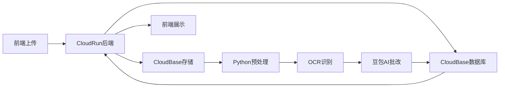
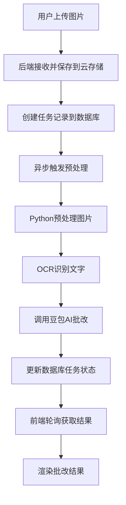

## 产品概述

修复AI作文批改系统在CloudRun容器部署环境下的数据库查询超时问题，并验证完整的作文批改流程正常运行。

## 核心功能

- 修复轮询接口的数据库查询超时问题（server.js第971行）
- 验证图片上传到云存储的完整流程
- 验证图片预处理和OCR识别功能
- 验证豆包AI批改接口调用
- 验证批改结果的前端渲染展示

## 技术栈

- 后端：Node.js + Express.js（server.js）
- 部署环境：CloudRun 容器
- 数据库：CloudBase 数据库
- 云存储：CloudBase 存储
- AI服务：豆包AI批改接口
- 前端：HTML + JavaScript

## 技术架构

### 系统架构



### 模块划分

**后端API模块（server.js）**

- 主要职责：处理HTTP请求、任务调度、数据库操作
- 关键技术：Express.js、CloudBase SDK
- 依赖：CloudBase数据库、存储服务
- 主要接口：上传接口、轮询接口（/api/task/:id）

**存储服务模块**

- 主要职责：图片上传、下载、临时文件管理
- 关键技术：CloudBase 存储 SDK
- 依赖：CloudBase 存储服务
- 主要接口：文件上传、文件下载

**图像处理模块**

- 主要职责：图片预处理、OCR文字识别
- 关键技术：Python图像处理库、OCR引擎
- 依赖：Python运行环境
- 主要接口：图像预处理、文字提取

**AI批改模块**

- 主要职责：调用豆包AI进行作文批改
- 关键技术：豆包AI API
- 依赖：豆包AI服务
- 主要接口：批改请求、结果获取

### 数据流



## 实现细节

### 核心目录结构

```
AI作文批改/
├── server.js              # 修改：修复第971行数据库查询超时
├── functions/
│   └── preprocess/        # Python预处理脚本
└── public/
    └── index.html         # 前端页面
```

### 关键代码结构

**任务状态数据结构**

```javascript
interface Task {
  _id: string;
  status: 'pending' | 'processing' | 'completed' | 'failed';
  imageUrl: string;
  ocrText?: string;
  correctionResult?: string;
  createdAt: Date;
  updatedAt: Date;
}
```

**轮询接口优化方案**

```javascript
// 修复前问题：db.get()超时
// 解决方案：增加超时处理、添加索引、优化查询条件
app.get('/api/task/:id', async (req, res) => {
  try {
    const result = await Promise.race([
      db.collection('tasks').doc(req.params.id).get(),
      new Promise((_, reject) => 
        setTimeout(() => reject(new Error('Database timeout')), 5000)
      )
    ]);
    res.json(result);
  } catch (error) {
    res.status(504).json({ error: 'Query timeout' });
  }
});
```

### 技术实现方案

**问题1：数据库查询超时**

- 问题陈述：CloudRun环境下db.get()操作在第971行超时（504错误）
- 解决方案：

1. 添加Promise.race超时控制机制
2. 优化数据库查询索引（为_id字段添加索引）
3. 增加数据库连接池配置
4. 添加重试机制

- 关键技术：Promise.race、数据库索引、连接池
- 实施步骤：

1. 定位server.js第971行的db.get()调用
2. 包装超时控制逻辑
3. 测试验证超时处理有效性
4. 添加错误日志记录
5. 优化数据库连接配置

- 测试策略：模拟高并发请求，验证超时处理和重试机制

**问题2：端到端流程验证**

- 问题陈述：需要验证从上传到展示的完整链路
- 解决方案：

1. 创建端到端测试脚本
2. 模拟真实用户操作流程
3. 验证每个环节的数据传递
4. 记录关键节点日志

- 关键技术：自动化测试、日志追踪
- 实施步骤：

1. 准备测试图片素材
2. 执行上传操作并记录响应
3. 验证云存储文件存在性
4. 检查预处理和OCR输出
5. 确认AI批改结果正确性

- 测试策略：使用多种图片格式和内容进行测试

### 集成点

- CloudBase数据库：使用官方SDK进行CRUD操作
- CloudBase存储：通过SDK上传下载文件
- 豆包AI服务：RESTful API调用
- Python预处理：通过子进程或HTTP接口调用

## 技术考量

### 日志记录

- 在关键流程节点添加详细日志
- 记录数据库查询耗时
- 记录每个处理环节的输入输出
- 使用结构化日志格式便于追踪

### 性能优化

- 数据库查询添加超时控制（5秒）
- 为常用查询字段添加索引
- 实施数据库连接池管理
- 优化图片处理性能（压缩、缓存）

### 安全措施

- 文件上传大小限制
- 文件类型白名单验证
- API请求频率限制
- 数据库查询参数验证

### 可扩展性

- 支持横向扩容CloudRun实例
- 数据库读写分离准备
- 缓存机制预留接口
- 异步任务队列化

## 推荐的智能体扩展

### Integration

- **tcb**
- 目的：用于修复数据库查询超时问题，优化CloudBase数据库连接和查询配置
- 预期结果：数据库查询响应时间降低到5秒以内，超时情况得到有效处理

### SubAgent

- **code-explorer**
- 目的：快速定位server.js第971行的数据库查询代码，并分析相关的数据库操作逻辑
- 预期结果：准确找到问题代码位置，理解当前实现方式和潜在问题点