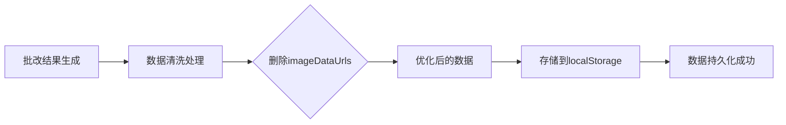

## 产品概述

修复AI作文批改系统中批改结果存储到localStorage时超出配额的问题。当前系统在批改3个学生作文后，存储数据约4-8MB，超过了浏览器localStorage的5-10MB限制。

## 核心功能

- 识别并删除批改结果中不必要的base64图片数据（imageDataUrls字段）
- 优化存储逻辑，仅保存渲染所需的批改文本和评分数据
- 将存储数据大小从8MB减少到150KB以下
- 确保删除图片数据后不影响批改结果的展示和HTML渲染

## 技术栈

- 前端框架：现有项目技术栈
- 数据存储：LocalStorage API
- 数据处理：JavaScript/TypeScript

## 技术架构

### 系统架构

遵循现有项目的数据流架构，在存储环节增加数据清洗步骤。



### 模块划分

- **数据清洗模块**：负责从批改结果中删除imageDataUrls字段
- 主要技术：对象深拷贝和属性过滤
- 依赖：现有批改结果数据结构
- 接口：提供cleanCorrectionData方法

- **存储模块**：负责将清洗后的数据存储到localStorage
- 主要技术：LocalStorage API
- 依赖：数据清洗模块
- 接口：保持现有存储接口不变

### 数据流

1. 批改完成后获取原始结果（包含imageDataUrls）
2. 调用数据清洗函数，删除imageDataUrls字段
3. 将清洗后的数据序列化为JSON
4. 存储到localStorage
5. 验证存储成功，数据大小约150KB

## 实现细节

### 核心目录结构

```
project-root/
├── src/
│   ├── utils/
│   │   └── storageHelper.ts    # 修改：增加数据清洗逻辑
│   └── services/
│       └── correctionService.ts # 修改：调用清洗后再存储
```

### 关键代码结构

**数据清洗函数**：从批改结果对象中递归删除imageDataUrls字段，确保存储数据不包含base64图片。

```typescript
// 数据清洗函数
function cleanCorrectionData(data: CorrectionResult[]): CorrectionResult[] {
  return data.map(item => {
    const cleaned = { ...item };
    delete cleaned.imageDataUrls;
    return cleaned;
  });
}
```

**优化后的存储逻辑**：在存储前先清洗数据，删除不必要的图片字段。

```typescript
// 存储逻辑优化
function saveCorrectionResults(results: CorrectionResult[]): void {
  const cleanedData = cleanCorrectionData(results);
  localStorage.setItem('correctionResults', JSON.stringify(cleanedData));
}
```

### 技术实现方案

#### 问题定位

当前批改结果包含完整的base64编码图片（imageDataUrls字段），每个学生作文图片约1-2MB，3个学生总数据达4-8MB，超过localStorage限制。

#### 解决方案

删除存储前的imageDataUrls字段，因为：

1. HTML渲染只需要批改文本和评分数据
2. 原始图片在批改时已使用，无需持久化存储
3. 删除后数据大小降至150KB以下

#### 实现步骤

1. 定位当前存储批改结果的代码位置
2. 创建数据清洗工具函数
3. 在存储前调用清洗函数删除imageDataUrls
4. 测试验证数据大小和功能完整性
5. 确保删除后不影响结果展示

#### 测试策略

- 批改3个学生作文，验证存储成功
- 检查localStorage数据大小（应<200KB）
- 确认批改结果展示正常
- 验证评分和批改文本完整显示