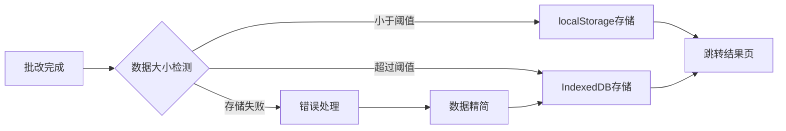

## 产品概述

修复AI作文批改系统中的localStorage配额超限问题，确保批改数据能够正常存储并顺利跳转到结果展示页面。

## 核心功能

- 诊断并定位localStorage超限的根本原因
- 实现数据存储优化方案，减少存储体积
- 采用替代存储方案（IndexedDB）处理大数据量
- 确保批改结果正常存储和页面跳转流畅
- 添加存储错误处理和降级机制

## 技术栈

- 前端框架：根据现有项目技术栈
- 存储方案：IndexedDB（替代localStorage处理大数据）
- 数据压缩：LZ-String或类似压缩库（可选优化）

## 技术架构

### 系统架构

基于现有项目架构，针对数据存储层进行优化改造，采用渐进式迁移策略：

- 保留localStorage用于小数据量存储
- 引入IndexedDB处理批改结果等大数据
- 添加存储适配层统一管理不同存储方式

### 模块划分

- **存储适配模块**：封装localStorage和IndexedDB操作，提供统一接口
- **数据优化模块**：处理数据精简和压缩
- **错误处理模块**：捕获存储异常并提供降级方案

### 数据流



## 实现细节

### 核心目录结构

```
project-root/
├── src/
│   ├── utils/
│   │   ├── storage.ts          # 新增：统一存储适配器
│   │   └── dataOptimizer.ts    # 新增：数据优化工具
│   └── services/
│       └── correctionService.ts # 修改：批改服务存储逻辑
```

### 关键代码结构

**StorageAdapter接口**：定义统一的存储操作接口，支持localStorage和IndexedDB两种实现，提供自动降级能力。

```typescript
// 存储适配器接口
interface StorageAdapter {
  saveData(key: string, data: any): Promise<boolean>;
  getData(key: string): Promise<any>;
  removeData(key: string): Promise<void>;
  checkQuota(): Promise<number>;
}

// IndexedDB实现
class IndexedDBStorage implements StorageAdapter {
  private dbName = 'CorrectionDB';
  private storeName = 'corrections';
  
  async saveData(key: string, data: any): Promise<boolean> {
    // 实现IndexedDB存储逻辑
  }
}
```

**数据优化策略**：实现批改数据的智能精简，移除冗余字段、压缩图片数据、采用增量存储。

```typescript
// 数据优化工具
class DataOptimizer {
  // 移除不必要的字段（如imageDataUrls）
  static removeRedundantFields(data: any) {
    const { imageDataUrls, ...cleanData } = data;
    return cleanData;
  }
  
  // 压缩大字段
  static compressData(data: any): string {
    return LZString.compress(JSON.stringify(data));
  }
}
```

### 技术实现方案

#### 问题诊断

**问题陈述**：localStorage默认配额约5-10MB，批改2个学生作文即超限
**解决策略**：

1. 分析当前存储数据结构，识别大字段（imageDataUrls等）
2. 计算单个批改记录实际占用空间
3. 确认是否存在重复或冗余数据

#### 存储优化方案

**问题陈述**：需要大幅减少数据存储体积
**解决策略**：

1. 移除所有base64图片数据（imageDataUrls字段）
2. 仅存储批改结果文本和元数据
3. 如需图片，改用对象URL或服务器存储
**关键技术**：数据字段白名单过滤
**实现步骤**：
4. 定义批改结果核心字段（学生信息、评分、评语）
5. 创建数据过滤函数，移除所有非核心字段
6. 在存储前应用过滤逻辑
7. 更新数据读取逻辑适配新结构

#### IndexedDB迁移

**问题陈述**：localStorage无法满足大数据存储需求
**解决策略**：引入IndexedDB作为主存储方案
**关键技术**：IndexedDB API、Promise封装
**实现步骤**：

1. 创建IndexedDB数据库和对象存储
2. 封装CRUD操作为Promise接口
3. 实现数据版本管理和迁移
4. 添加存储容量检测
5. 提供localStorage降级方案

#### 错误处理机制

**问题陈述**：存储失败时需要友好提示和降级方案
**解决策略**：

1. 捕获QuotaExceededError等存储异常
2. 尝试清理旧数据或切换存储方式
3. 向用户展示明确的错误提示
**实现步骤**：
4. 在存储操作外层添加try-catch
5. 实现自动清理策略（如删除最旧记录）
6. 记录错误日志用于问题追踪

### 集成点

- 批改服务与存储适配层集成
- 结果页面从新存储方案读取数据
- 错误处理与UI提示组件集成

## 技术考量

### 性能优化

- IndexedDB异步操作避免阻塞UI
- 大数据分块存储提升读写速度
- 实现缓存策略减少重复读取

### 兼容性

- IndexedDB在所有现代浏览器中支持良好
- 提供localStorage降级保证基本功能
- 测试Safari私密模式等特殊场景

## 代理扩展

### SubAgent

- **code-explorer**
- 目的：全面分析当前项目中所有涉及localStorage存储的代码位置
- 预期结果：定位batchCorrectionData存储逻辑、识别所有存储字段、找出imageDataUrls等大数据字段的使用位置