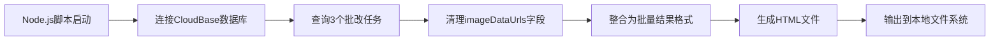

## 产品概述

创建一个Node.js脚本，从云数据库中读取已完成的作文批改任务数据，清理大体积的base64图片数据，并生成一个可交互的HTML页面，支持在多个学生的批改结果之间切换查看。

## 核心功能

- 连接云数据库并查询指定的3个批改任务记录
- 清理任务数据中的imageDataUrls字段以减少数据体积
- 整合多个学生的批改结果为统一的数据结构
- 生成独立的HTML文件，包含批改结果展示和学生切换功能
- 支持在浏览器中直接打开查看，无需重新批改

## 技术栈选择

- **运行环境**: Node.js
- **数据库**: 腾讯云CloudBase数据库（已连接）
- **输出格式**: 静态HTML页面
- **数据处理**: JavaScript原生方法

## 技术架构

### 系统架构

采用简单的脚本执行模式：数据库读取 → 数据清理 → HTML生成



### 模块划分

- **数据库模块**: 使用tcb集成连接CloudBase，执行数据查询
- **数据处理模块**: 清理不需要的字段，转换数据格式
- **HTML生成模块**: 将数据嵌入HTML模板，生成可交互页面

### 数据流

1. 脚本通过tcb SDK连接数据库
2. 根据任务ID列表查询correctionTasks集合
3. 遍历查询结果，删除每个任务的imageDataUrls字段
4. 将清理后的数据整合为批量结果数组
5. 将数据JSON嵌入HTML模板的script标签中
6. 输出为独立的HTML文件

## 实现细节

### 核心目录结构

```
project-root/
├── scripts/
│   └── generate-batch-results.js  # 新增：数据读取与HTML生成脚本
└── output/
    └── batch-results.html         # 新增：生成的展示页面
```

### 关键代码结构

**任务数据接口**：定义从数据库读取的批改任务数据结构

```javascript
interface CorrectionTask {
  _id: string;
  studentName: string;
  essayContent: string;
  correctionResult: {
    overallScore: number;
    suggestions: string;
    detailedScores: object;
  };
  imageDataUrls?: string[];  // 需要删除的字段
  createdAt: Date;
}
```

**数据库查询函数**：使用tcb SDK执行批量查询

```javascript
async function fetchTasks(taskIds) {
  const db = tcb.database();
  const tasks = await db.collection('correctionTasks')
    .where({
      _id: db.command.in(taskIds)
    })
    .get();
  return tasks.data;
}
```

**数据清理函数**：移除大体积字段并转换格式

```javascript
function cleanTaskData(tasks) {
  return tasks.map(task => {
    const { imageDataUrls, ...cleanTask } = task;
    return cleanTask;
  });
}
```

### 技术实现方案

#### 数据库连接与查询

- **问题**: 需要从CloudBase数据库读取指定任务
- **解决方案**: 使用tcb集成的SDK，通过任务ID列表批量查询
- **关键技术**: @cloudbase/node-sdk
- **实现步骤**:

1. 初始化tcb实例并获取数据库引用
2. 使用db.command.in()查询多个任务ID
3. 验证查询结果数量是否匹配
4. 处理查询异常情况

- **测试策略**: 确认3个任务都成功读取，数据完整性验证

#### 数据清理与格式转换

- **问题**: imageDataUrls字段占用大量空间，需要移除
- **解决方案**: 使用解构赋值和展开运算符清理数据
- **关键技术**: JavaScript对象解构
- **实现步骤**:

1. 遍历查询结果数组
2. 对每个任务使用解构排除imageDataUrls
3. 保留其他所有批改相关数据
4. 转换为前端展示所需格式

- **测试策略**: 验证清理后的数据大小，确保关键字段完整

#### HTML页面生成

- **问题**: 需要生成包含数据和交互逻辑的独立HTML文件
- **解决方案**: 使用模板字符串嵌入数据和前端代码
- **关键技术**: Node.js fs模块，HTML/CSS/JavaScript
- **实现步骤**:

1. 创建HTML模板，包含样式和脚本占位符
2. 将清理后的数据JSON.stringify()后嵌入
3. 添加学生切换的前端交互逻辑
4. 写入到output目录

- **测试策略**: 在浏览器中打开生成的HTML，验证切换功能

### 集成点

- **CloudBase数据库**: 通过tcb集成读取correctionTasks集合数据
- **文件系统**: 使用Node.js原生fs模块写入HTML文件
- **数据格式**: 任务数据以JSON格式嵌入HTML的script标签中

## 技术考量

### 性能优化

- 单次查询读取所有任务，避免多次数据库连接
- 清理base64图片数据大幅减少最终HTML文件体积
- 生成静态HTML，无需运行时数据库连接

### 安全措施

- 脚本仅在本地执行，不暴露数据库凭证
- 生成的HTML文件本地存储，不涉及网络传输

### 可扩展性

- 支持修改任务ID列表以生成不同学生组合的页面
- HTML模板可复用，易于调整样式和交互逻辑

## Agent Extensions

### Integration

- **tcb**
- 用途：连接CloudBase数据库，执行批改任务数据的批量查询操作
- 预期结果：成功读取3个指定任务ID的完整批改数据，包括学生信息、作文内容和批改结果