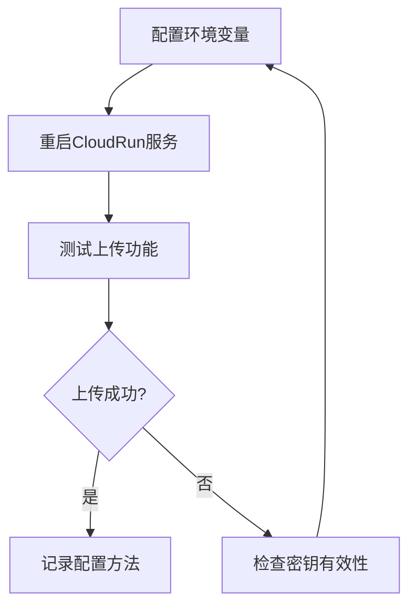

## 产品概述

恢复CloudRun环境中的CloudBase访问凭证配置，修复因密钥丢失导致的上传功能故障。

## 核心功能

- 在CloudRun环境变量中重新配置TCB_SECRET_ID和TCB_SECRET_KEY
- 验证CloudBase连接和上传功能是否恢复正常
- 确保配置持久化，避免未来重新部署时丢失

## 技术方案

### 问题分析

CloudRun环境变量在重新部署过程中未被持久化保存，导致TCB_SECRET_ID和TCB_SECRET_KEY丢失，影响CloudBase集成的上传功能。

### 解决方案

#### 环境变量配置恢复

通过CloudBase Integration (tcb) 重新配置环境变量：

- 在CloudRun控制台或配置文件中添加TCB_SECRET_ID
- 在CloudRun控制台或配置文件中添加TCB_SECRET_KEY
- 触发服务重启以加载新配置

#### 持久化策略

为防止未来部署时丢失配置，采用以下方案：

- 将环境变量配置写入项目配置文件（如cloudbaserc.json或.env文件）
- 在CI/CD流程中自动注入环境变量
- 在部署文档中记录必需的环境变量配置清单

### 验证流程

### 技术实现步骤

1. 使用tcb integration访问CloudBase控制台
2. 在CloudRun环境配置中添加TCB_SECRET_ID和TCB_SECRET_KEY
3. 重启CloudRun服务使配置生效
4. 执行上传测试验证功能恢复
5. 将环境变量配置写入项目文档或配置文件

## Agent Extensions

### Integration

- **tcb**
- 用途：访问CloudBase控制台，配置CloudRun环境变量
- 预期结果：成功添加TCB_SECRET_ID和TCB_SECRET_KEY到CloudRun环境配置中